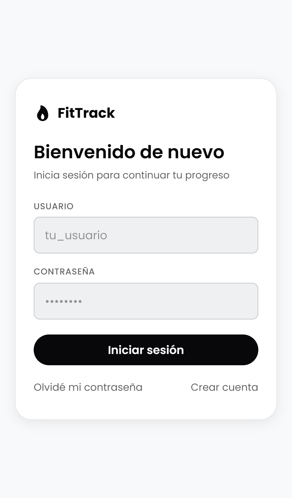
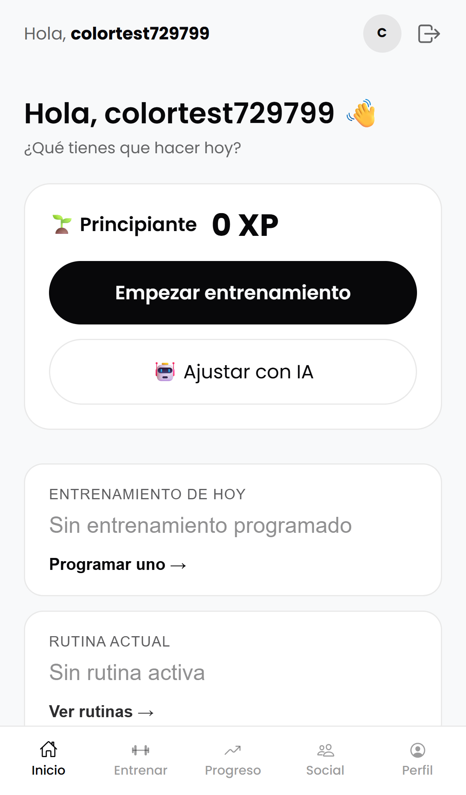
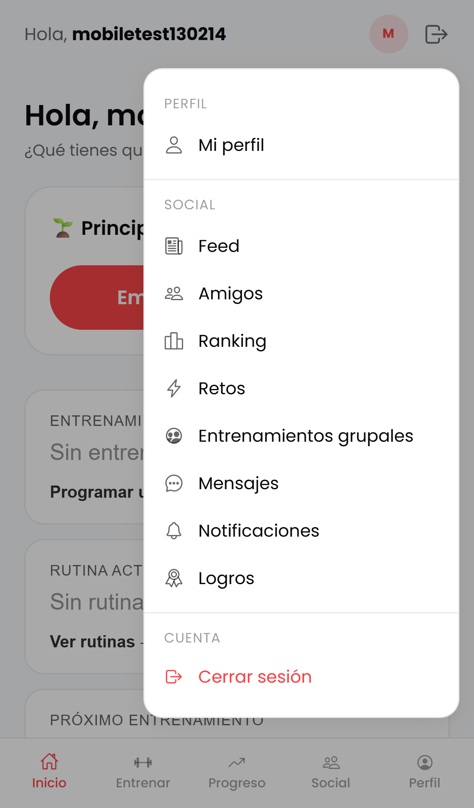
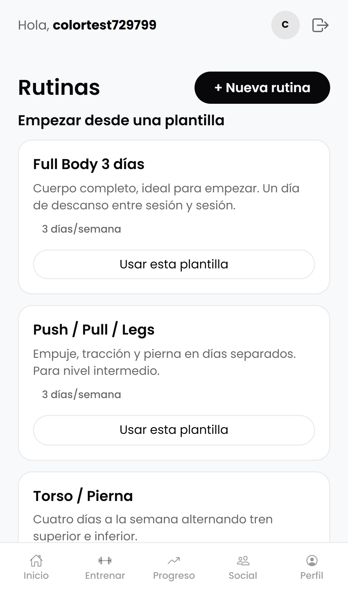
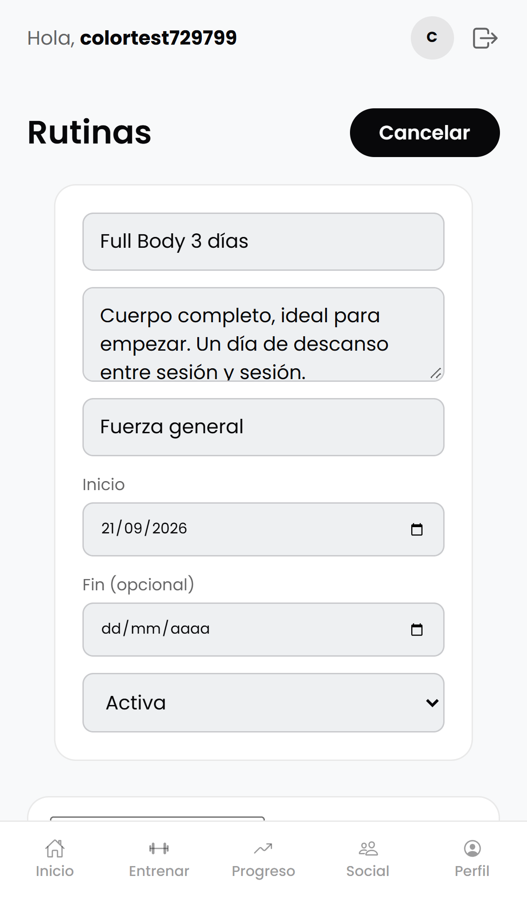
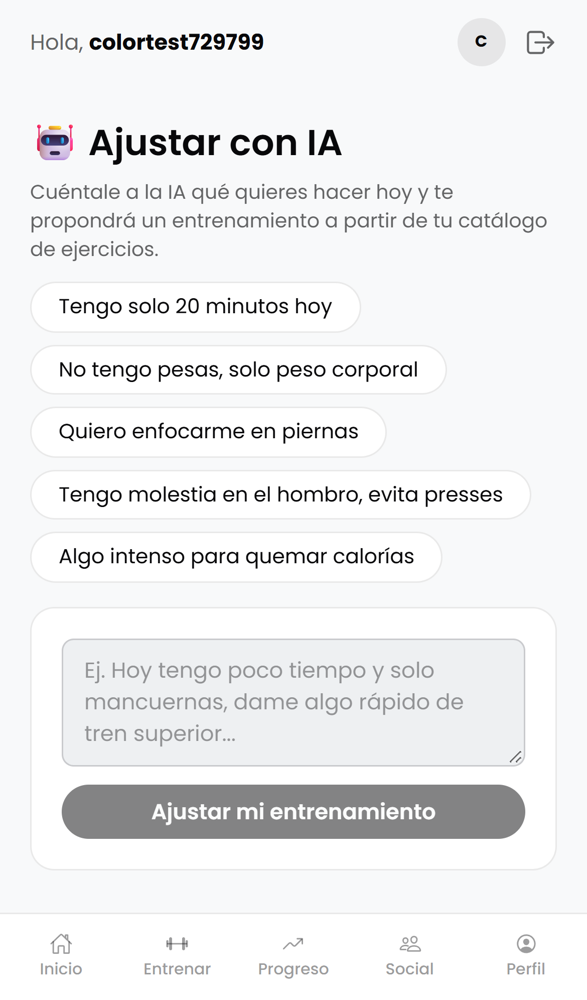
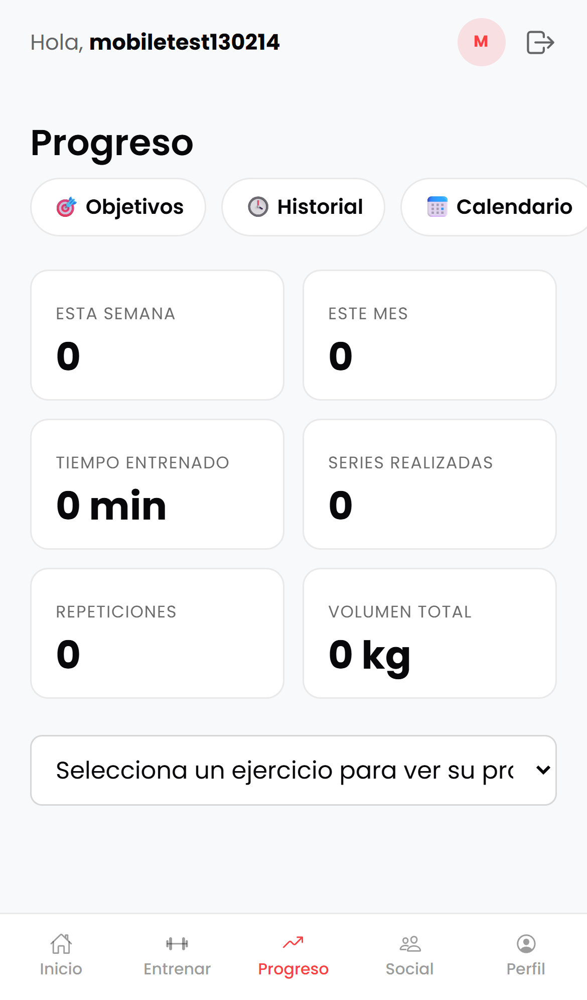
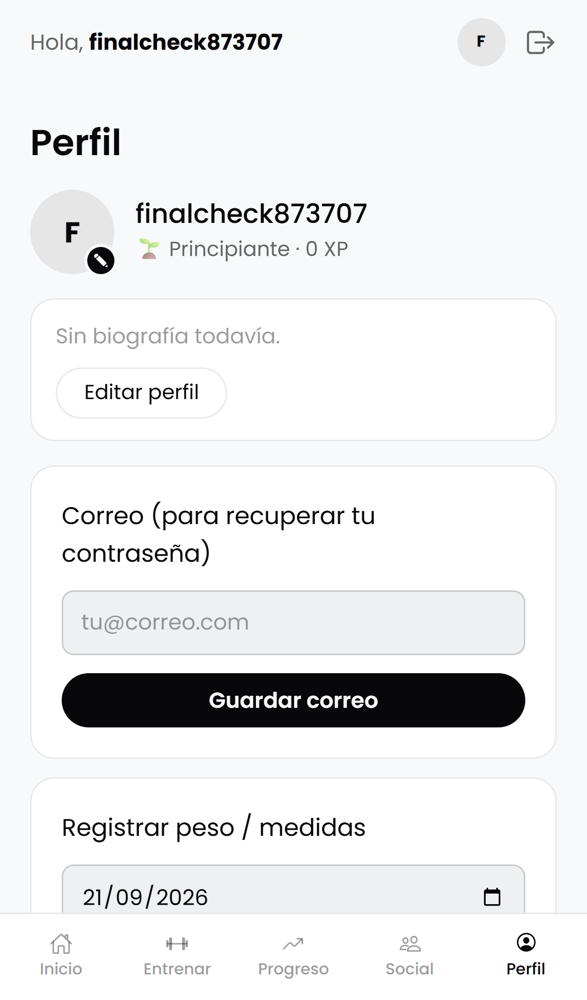

# FitTrack

Aplicación móvil de seguimiento de entrenamiento construida con **Ionic +
Angular** (frontend, este repositorio) y una **API REST en PHP puro**
(backend: [fittrack-api](https://github.com/YaroldLozano/fittrack-api)),
sobre MySQL.

## Objetivo de la aplicación

FitTrack ayuda a una persona a planificar, ejecutar y dar seguimiento a su
entrenamiento de fuerza: crear rutinas por días con ejercicios, registrar
cada serie realizada (con detección automática de récords personales),
consultar su progreso e historial, fijar objetivos, y mantenerse motivada a
través de un componente social (feed, amigos, retos, ranking, logros y
gamificación por XP). Además, incorpora una **herramienta de IA** que ajusta
el entrenamiento del día a partir de una petición en lenguaje natural del
usuario (por ejemplo: *"hoy tengo 20 minutos y solo mancuernas"*).

## Stack técnico

- **Frontend:** Ionic 9 + Angular 22, TypeScript, SCSS con un sistema de
  *design tokens* propio (`src/theme/tokens.scss`).
- **Backend:** PHP 8 sin framework (router propio, `src/Controllers` /
  `Services` / `Models`), JWT para autenticación, MySQL/MariaDB.
- **IA:** API de Claude (Anthropic), invocada desde el backend con *tool use*
  forzado para obtener siempre una propuesta de entrenamiento estructurada y
  válida contra el catálogo real de ejercicios del usuario.

## Cómo ejecutarlo

Son **dos repositorios separados** que se ejecutan juntos:

- Este repo: frontend Ionic/Angular.
- [fittrack-api](https://github.com/YaroldLozano/fittrack-api): backend PHP
  (repositorio propio, con su propio README).

**Backend** (requiere PHP + MySQL, p. ej. XAMPP) — ver detalle completo en el
README de [fittrack-api](https://github.com/YaroldLozano/fittrack-api):
1. Base de datos MySQL llamada `Yarold` con el esquema descrito en
   [`docs/modelo-datos.md`](docs/modelo-datos.md).
2. `composer install` dentro de `fitness-api/`.
3. Copiar `fitness-api/.env.example` a `.env` y completar credenciales de BD
   y `JWT_SECRET`. Para la herramienta de IA, agregar `ANTHROPIC_API_KEY`
   (se obtiene en console.anthropic.com).
4. Servir la carpeta `fitness-api/` con Apache (XAMPP) en
   `http://localhost/fitness-api`.

**Frontend:**
```bash
npm install
ionic serve
```
La app queda disponible en `http://localhost:8100`.

## Páginas / vistas principales

La app tiene más de 20 vistas; las más relevantes:

| Vista | Ruta | Descripción |
|---|---|---|
| Login / Registro | `/auth` | Inicio de sesión, registro y recuperación de contraseña |
| Dashboard | `/app/dashboard` | Resumen del día: XP, racha, entrenamiento de hoy, rutina activa |
| Rutinas | `/app/routines` | Crear/editar rutinas por día, o partir de una **plantilla predeterminada** |
| Entrenar | `/app/workout` | Ejecutar el entrenamiento del día, registrar series |
| **Ajustar con IA** | `/app/ai-coach` | Pedirle a la IA que arme/ajuste el entrenamiento del día |
| **Notas** | `/app/notes` | Notas privadas guardadas en el dispositivo (persistencia local, ver [`docs/persistencia.md`](docs/persistencia.md)) |
| Progreso / Historial | `/app/progress`, `/app/history` | Estadísticas, gráficos y entrenamientos pasados |
| Perfil / Social | `/app/profile`, `/app/feed`, `/app/ranking` | Perfil, feed social, amigos, ranking, retos |

Ver capturas de estas y otras vistas en [`screenshots/`](screenshots/).

## Modelo de datos

- [`docs/modelo-datos.md`](docs/modelo-datos.md) — modelo de la **base de
  datos** (MySQL): diagrama entidad-relación del núcleo de entrenamiento
  (usuarios, ejercicios, rutinas, sesiones, series, objetivos) y tabla
  resumen de los módulos sociales/gamificación.
- [`docs/capa-acceso-datos.md`](docs/capa-acceso-datos.md) — modelo del
  **frontend**: las interfaces TypeScript de cada entidad, los servicios
  Angular que implementan el acceso a datos (capa DAO sobre la API REST),
  su cobertura de operaciones CRUD, y un diagrama de clases.
- [`docs/persistencia.md`](docs/persistencia.md) — persistencia **local
  al dispositivo** (Ionic Storage) para datos que no pasan por el
  backend: notas de entrenamiento, con alta/consulta/modificación/
  eliminación que sobreviven a cerrar y reabrir la app.
- [`docs/api-externa-ejercicios.md`](docs/api-externa-ejercicios.md) —
  consumo de una **API REST externa** (wger.de) desde el backend PHP para
  explorar un catálogo de ejercicios más amplio e importarlo (adaptado)
  al catálogo propio del usuario.

## Capturas de ejecución

| | |
|---|---|
|  |  |
| Login | Dashboard |
|  |  |
| Menú de navegación | Rutinas — plantillas predeterminadas |
|  |  |
| Constructor de rutina (agregar/ajustar ejercicios) | Herramienta de IA |
|  |  |
| Progreso | Perfil |

Todas las capturas están tomadas con emulación de iPhone 14 (390×844) para
verificar la vista móvil real de la app.

## Uso de IA en el desarrollo

- [`docs/prompts-ia.md`](docs/prompts-ia.md) — evidencia de prompts usados
  con IA (mínimo 3, con el detalle de qué se pidió en cada uno) y una
  explicación de qué código generado se aceptó, se modificó tras detectar un
  problema, o no aplicó por ya existir en el proyecto.
- [`docs/prompts-ia-modelado.md`](docs/prompts-ia-modelado.md) — mismo tipo
  de explicación, específica para el modelado de entidades y la capa de
  acceso a datos (servicios Angular).
- [`docs/prompts-ia-persistencia.md`](docs/prompts-ia-persistencia.md) —
  mismo tipo de explicación, específica para la persistencia local
  (Ionic Storage).
- [`docs/prompts-ia-api-externa.md`](docs/prompts-ia-api-externa.md) —
  mismo tipo de explicación, específica para el consumo de la API externa
  de ejercicios (wger.de).
