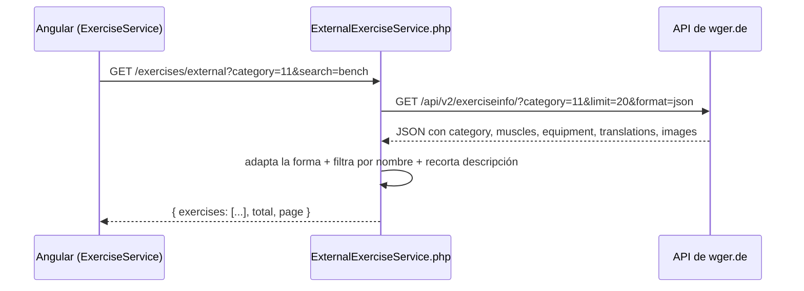

# Catálogo externo de ejercicios (API de wger.de)

Documenta el consumo de una **API REST externa** — [wger.de](https://wger.de)
(gratuita, pública, sin API key) — para explorar un catálogo de ejercicios
mucho más grande que el propio, y "adaptarlo" al modelo de datos de
FitTrack importando lo que el usuario elija a su catálogo personal.

## Arquitectura: el backend PHP es el que llama a la API externa

Igual que la herramienta de IA (que llama a Anthropic desde PHP, no desde
Angular), la llamada a wger.de se hace **desde el backend**, no directo
desde el navegador:



Ventajas de este diseño (igual que con la IA): la app nunca expone al
cliente cómo está estructurada la API externa real, el backend puede
cachear/normalizar/filtrar antes de responder, y si wger.de cambiara de
forma solo hay que tocar un archivo PHP.

## Backend

| Archivo | Rol |
| --- | --- |
| `src/Services/ExternalExerciseService.php` | Llama a wger.de vía cURL (`/exercisecategory/`, `/exerciseinfo/`) y adapta la respuesta |
| `src/Controllers/ExternalExerciseController.php` | `categories()` y `index()` |
| `routes.php` | `GET /exercises/external/categories`, `GET /exercises/external?category=&search=&page=` |

La adaptación (`ExternalExerciseService::search`) hace tres cosas sobre
la respuesta cruda de wger:

1. Extrae la traducción en inglés de cada ejercicio (wger es multi-idioma).
2. Filtra por texto en el nombre (`search`) — wger ya no expone un
   endpoint de búsqueda difusa, así que se filtra en PHP sobre la página
   pedida.
3. Devuelve una forma mínima y estable, sin todos los campos internos de
   wger (licencias, historial de autores, uuids, etc.):

```php
[
  'external_id' => 73,
  'name' => 'Bench Press',
  'description' => 'Lay down on a bench, the bar should be directly above your eyes...',
  'category' => 'Chest',
  'muscles' => ['Chest'],
  'equipment' => ['Barbell', 'Bench'],
  'image_url' => 'https://wger.de/media/exercise-images/192/Bench-press-1.png.400x400_q85.png',
]
```

## Frontend: buscar e importar

[`exercise.service.ts`](../src/app/core/services/exercise.service.ts) suma
dos métodos (`externalCategories()`, `searchExternal()`), y
[`exercises.page.ts`](../src/app/exercises/exercises.page.ts) agrega un
panel "Explorar catálogo externo" con selector de categoría, búsqueda por
texto, y tarjetas de resultado con botón **Importar**.

**Importar = adaptar el dato externo al modelo propio**, no solo copiarlo:
el ejercicio de wger no tiene un `muscle_group_id` de FitTrack (son
catálogos distintos), así que `importFromExternal()` precarga el
formulario de "nuevo ejercicio" ya existente con:

- `name` → tal cual
- `equipment` → `ext.equipment.join(', ')`
- `description` → tal cual (ya recortada por el backend)
- `muscle_group_id` → adivinado por nombre de categoría, con esta tabla
  de equivalencia (wger es en inglés, FitTrack en español):

| Categoría wger | Grupo muscular FitTrack |
| --- | --- |
| Chest | Pecho |
| Back | Espalda |
| Shoulders | Hombros |
| Legs | Piernas |
| Abs | Abdomen |
| Cardio | Cardio |
| Arms *(sin mapeo)* | — (el usuario elige Bíceps o Tríceps) |
| Calves *(sin mapeo)* | — (FitTrack no tiene ese grupo) |

El usuario revisa/ajusta el formulario ya precargado (puede cambiar
cualquier campo) y lo guarda con el mismo botón "Guardar ejercicio" que
ya existía — el ejercicio importado queda como un ejercicio **propio**
del usuario (`user_id` no nulo), igual que uno creado a mano, y a partir
de ahí se puede usar en rutinas, entrenamientos, etc. como cualquier otro.

## Verificación

Probado de punta a punta contra la API real (no solo lectura de código):
`GET /exercises/external/categories` (8 categorías), `GET /exercises/external?category=11&search=bench`
(7 resultados de pecho), y el flujo completo en la UI (Playwright): buscar
"bench" en "Chest" → Importar → formulario precargado con
`muscle_group_id` = Pecho → Guardar → el ejercicio aparece en "Mis
ejercicios" con grupo muscular y equipo correctos.
