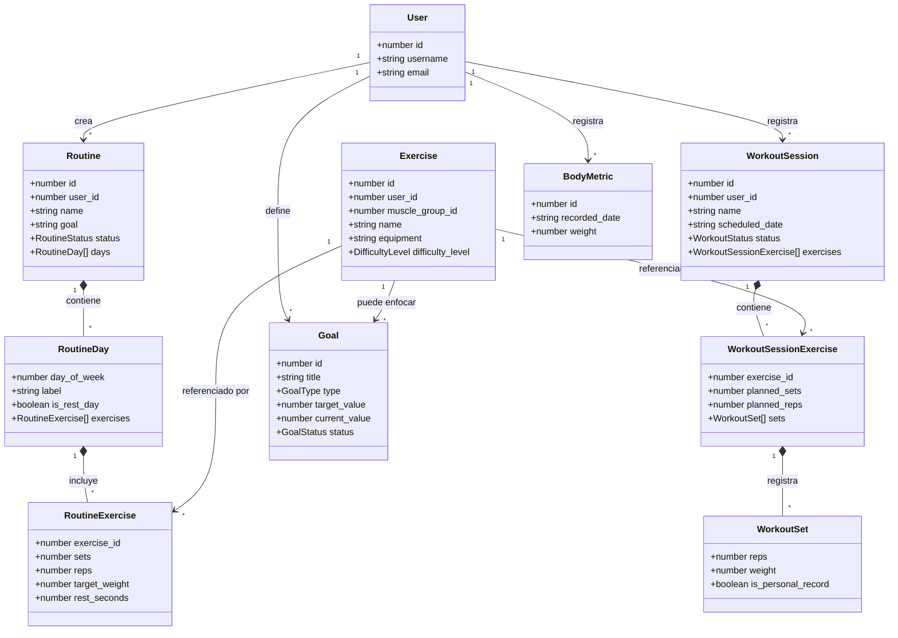

# Modelado y objetos de acceso a datos (Angular/Ionic)

Este documento cubre la capa de datos del **frontend**: las entidades que
maneja la aplicación (interfaces TypeScript) y los servicios Angular que
implementan el acceso a datos (comunicación HTTP con la API REST del
backend). Es el complemento, del lado del cliente, del modelo de base de
datos ya documentado en [`modelo-datos.md`](modelo-datos.md).

## 1. Entidades (interfaces TypeScript)

Cada entidad de negocio tiene su interfaz en `src/app/core/models/`. Son el
"modelo de datos" que usa toda la app — los componentes y servicios nunca
trabajan con `any`, siempre con estos tipos.

| Entidad | Archivo | Campos principales |
|---|---|---|
| `User` | `models/user.model.ts` | `id`, `username`, `email` |
| `Exercise` / `MuscleGroup` | `models/exercise.model.ts` | `id`, `user_id` (null = global), `muscle_group_id`, `name`, `equipment`, `difficulty_level` |
| `Routine` / `RoutineDay` / `RoutineExercise` | `models/routine.model.ts` | `Routine.days: RoutineDay[]`, `RoutineDay.exercises: RoutineExercise[]`, cada `RoutineExercise` tiene `exercise_id`, `sets`, `reps`, `target_weight`, `rest_seconds` |
| `WorkoutSession` / `WorkoutSessionExercise` / `WorkoutSet` | `models/workout.model.ts` | `WorkoutSession.exercises: WorkoutSessionExercise[]`, cada uno con `sets: WorkoutSet[]` (series ya ejecutadas) |
| `Goal` | `models/goal.model.ts` | `id`, `title`, `type`, `target_value`, `current_value`, `status`, `progress_percent` |
| `BodyMetric` | `models/body-metric.model.ts` | `id`, `recorded_date`, `weight`, `body_fat_percentage`, medidas corporales |
| `AiWorkoutSuggestion` | `models/ai.model.ts` | `name`, `note`, `exercises: AiWorkoutExercise[]` — respuesta de la herramienta de IA |

Además existen interfaces para el dominio social (`post.model.ts`,
`friend.model.ts`, `chat.model.ts`, `notification.model.ts`,
`achievement.model.ts`, `group-workout.model.ts`, `challenge.model.ts`,
`story.model.ts`), fuera del alcance de este documento por no ser el núcleo
de seguimiento de entrenamiento.

## 2. Diagrama de clases (entidades)



## 3. Servicios de acceso a datos (capa DAO)

Cada entidad tiene un servicio Angular en `src/app/core/services/`,
inyectable (`providedIn: 'root'`), que encapsula las llamadas HTTP a la API
(`HttpClient`) y devuelve observables tipados con las interfaces de la
sección 1. Los componentes **nunca** llaman a `HttpClient` directamente —
siempre pasan por estos servicios.

| Servicio | Entidad | Create | Read | Update | Delete |
|---|---|:---:|:---:|:---:|:---:|
| `ExerciseService` | `Exercise` | `create()` → `POST /exercises` | `list()` → `GET /exercises` | `update()` → `PUT /exercises/:id` | `delete()` → `DELETE /exercises/:id` |
| `RoutineService` | `Routine` | `create()` → `POST /routines` | `list()` / `get(id)` → `GET /routines[/:id]` | `update()` → `PUT /routines/:id` | `delete()` → `DELETE /routines/:id` |
| `WorkoutService` | `WorkoutSession` | `create()` → `POST /workouts` | `list()` / `get(id)` → `GET /workouts[/:id]` | `addSet()` → `POST /workouts/:id/sets` (agrega una serie) | `delete()` → `DELETE /workouts/:id` |
| `GoalService` | `Goal` | `create()` → `POST /goals` | `list()` → `GET /goals` | `update()` → `PUT /goals/:id` | `delete()` → `DELETE /goals/:id` |
| `BodyMetricService` | `BodyMetric` | `upsert()` → `POST /body-metrics` (crea o actualiza el registro del día) | `list()` → `GET /body-metrics` | *(mismo `upsert()`)* | — *(no aplica: es un registro histórico de medición, no se borra)* |
| `AiService` | `AiWorkoutSuggestion` | `suggestWorkout()` → `POST /ai/suggest-workout` | — | — | — *(servicio de consulta, no persiste una entidad propia)* |

`WorkoutSession` no tiene un `update()` genérico a propósito: su ciclo de
vida son transiciones de estado explícitas del dominio (`start()`,
`complete()`, `addSet()`), no una edición libre de campos — es una decisión
de diseño, no un hueco pendiente.

## 4. Ejemplo completo de CRUD: `Goal`

`Goal` (objetivo del usuario) es el ejemplo más directo de las cuatro
operaciones, de punta a punta (Angular → API PHP → MySQL):

```ts
// src/app/core/services/goal.service.ts
@Injectable({ providedIn: 'root' })
export class GoalService {
  constructor(private http: HttpClient) {}

  list(): Observable<{ success: boolean; goals: Goal[] }> {
    return this.http.get<{ success: boolean; goals: Goal[] }>(`${environment.apiUrl}/goals`);
  }

  create(data: Partial<Goal>): Observable<{ success: boolean; goal: Goal }> {
    return this.http.post<{ success: boolean; goal: Goal }>(`${environment.apiUrl}/goals`, data);
  }

  update(id: number, data: Partial<Goal>): Observable<{ success: boolean; goal: Goal }> {
    return this.http.put<{ success: boolean; goal: Goal }>(`${environment.apiUrl}/goals/${id}`, data);
  }

  delete(id: number): Observable<{ success: boolean }> {
    return this.http.delete<{ success: boolean }>(`${environment.apiUrl}/goals/${id}`);
  }
}
```

`goals.page.ts` los consume así (`create` al enviar el formulario, `update`
al marcar como completado, `delete` al eliminar):

```ts
this.goalService.create({ title, type, target_value, unit }).subscribe(...);
this.goalService.update(goal.id, { status: 'completed' }).subscribe(...);
this.goalService.delete(goal.id).subscribe(...);
```

Antes de esta entrega, `delete()` **no existía** — ni en el servicio Angular
ni en el backend (`GoalController`/`GoalService`/`GoalModel` en PHP). Se
agregó siguiendo exactamente el mismo patrón ya usado por `RoutineService`
(`deleteOwned`), y se verificó con una prueba manual del ciclo completo:

```
POST   /goals        → crea "Prueba CRUD"          (id 4)
GET    /goals        → aparece en la lista          ✓
PUT    /goals/4      → título → "Prueba CRUD editada" ✓
DELETE /goals/4      → {"success":true,"message":"Objetivo eliminado"}
GET    /goals        → ya no aparece                ✓
```

## Ver también

- [`modelo-datos.md`](modelo-datos.md) — modelo de la base de datos (MySQL) que respalda estas entidades.
- [`prompts-ia-modelado.md`](prompts-ia-modelado.md) — cómo se usó IA para generar/revisar este modelo.
