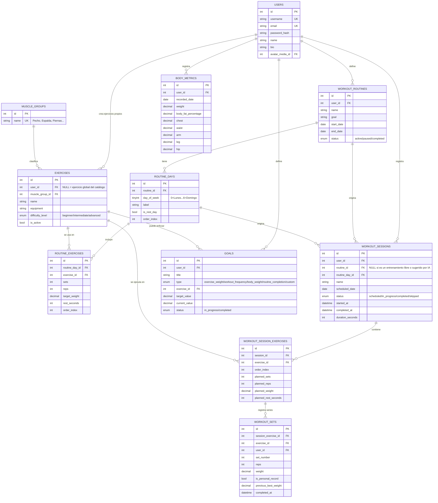

# Modelo de datos — FitTrack

Base de datos relacional (MySQL/MariaDB, esquema `Yarold`), consumida por el backend
PHP en `C:\xampp\htdocs\fitness-api`. El núcleo del modelo cubre entrenamiento
(ejercicios, rutinas, sesiones, series) y se extiende con módulos sociales y de
gamificación que comparten el mismo `users.id` como dueño de cada registro.

## Núcleo: ejercicios, rutinas y entrenamientos

### Relaciones clave

- Un **ejercicio** (`exercises`) puede ser global (`user_id NULL`, visible para
  todos) o personalizado por un usuario (`user_id` propio).
- Una **rutina** (`workout_routines`) se organiza en **días** (`routine_days`,
  0=Lunes..6=Domingo), y cada día planificado tiene una lista de **ejercicios
  planeados** (`routine_exercises`) con series/repeticiones/peso objetivo.
- Un **entrenamiento del día** (`workout_sessions`) es una instancia concreta:
  puede nacer de un `routine_day` (se copian sus ejercicios planeados como
  snapshot), crearse libre, o crearse a partir de una propuesta de la
  herramienta de IA — en los tres casos termina con sus propios
  `workout_session_exercises`.
- Cada **serie ejecutada** (`workout_sets`) queda ligada al ejercicio de la
  sesión y calcula si fue **récord personal** (`is_personal_record`) comparando
  contra el mejor peso histórico del usuario en ese ejercicio.

## Módulos adicionales (mismo esquema, fuera del diagrama por espacio)

| Módulo | Tablas principales | Propósito |
|---|---|---|
| Social | `posts`, `post_media`, `post_comments`, `post_likes`, `stories`, `story_views`, `friendships`, `friend_requests`, `blocked_users` | Feed, historias e interacción entre usuarios |
| Mensajería | `conversations`, `messages` | Chat directo entre amigos |
| Gamificación | `xp_transactions`, `user_stats`, `achievements`, `user_achievements` | XP, niveles, rachas y logros |
| Ranking | `ranking_meta`, `seasons`, `season_results` | Tablas de posiciones global/amigos/temporada |
| Retos y grupos | `challenges`, `challenge_participants`, `group_workouts`, `group_workout_participants` | Retos 1v1 y entrenamientos grupales |
| Notificaciones y medios | `notifications`, `media` | Avisos in-app y almacenamiento de imágenes/videos |
| Cuenta | `password_resets`, `token_denylist` | Recuperación de contraseña y cierre de sesión (JWT) |

## Fuente de la verdad

El esquema real vive en la base de datos (`Yarold`, MySQL) y se refleja en las
clases `App\Models\*` del backend (`fitness-api/src/Models`). Este documento es
una foto del modelo al momento de la entrega; no hay migraciones versionadas en
el repo (el proyecto usa phpMyAdmin/consola MySQL directamente).
